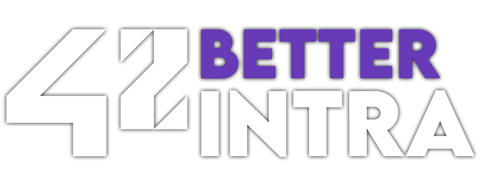

<h1 align="center"></h1>

A simple browser extension enabling quality of life features for 42's <a href="https://intra.42.fr/">intranet</a>. 
Compatible with Intra V3.

## Quick install

## Features
- Custom user nicknames
- Custom profile background

Planned:
- Monthly logtimes display
- Pin friends on your profile
